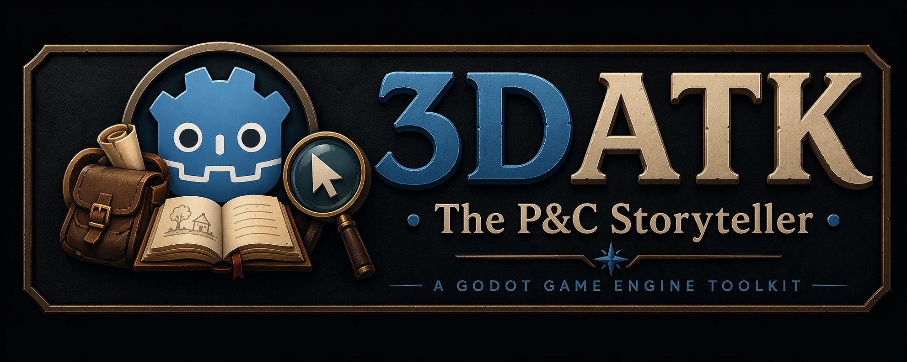

# 3DATK for Godot by USE Web

## Why This Addon Exists

3DATK exists to let creators build story-driven 3D point-and-click adventures without constantly writing custom scripts.

The project is built for designers first:

- inspector-first setup
- reusable templates
- state-driven progression
- save/load-safe interactions
- shared systems over one-off logic

## Naming Clarification

Brand name: **3DATK**  
Runtime code prefix: **ATK** (for classes, resources, autoloads, and menu paths)

Examples:

- `ATKScenes`, `ATKState`, `ATKInventory`
- `ATKAdventureObject`, `ATKDoor`, `ATKPickup`, `ATKNPC`
- editor menu path: `ATK/...`

## Core Capabilities

- scene and spawn management (`ATKSceneRoot`, `ATKSpawnPoint`, `ATKScenes`)
- click-to-move, click-to-interact, right-click inspect
- interaction rules with conditions and action sequences
- doors, pickups, NPC handovers, triggers, exits
- dialogue, quests, journal, hints
- options/settings (video, audio, controls)
- save/load persistence for story state
- cursor theme system with global drag/drop icons
- inventory with icon-based tiles and selected-item HUD preview

## New UX Systems (Current)

### Cursor Theme (Global Asset)

Cursor behavior is now theme-driven with a dedicated resource:

- `addons/adventure_toolkit/resources/cursors/atk_cursor_theme.gd`
- `addons/adventure_toolkit/resources/cursors/default_cursor_theme.tres`

Supported cursor slots:

- `cursor_normal`
- `cursor_interact`
- `cursor_inspect`
- `cursor_open`
- `cursor_attack`
- `cursor_climb`
- `cursor_descend`

Hover behavior can be controlled per object through:

- `hover_cursor_intent`
- `is_openable`, `is_attackable`, `is_climbable`, `is_descendable`

### Inventory Icons and Classic Tile Grid

Inventory is icon-first now:

- fixed-size icon tiles
- oversized images constrained by max icon bounds
- quantity badge overlay (`xN`) only when amount > 1
- right-click inspect on inventory items
- selected item icon preview at lower-right HUD
- inventory auto-closes after item selection

Item icon sources (priority):

1. pickup `inventory_icon_override`
2. pickup/object `ui_icon`
3. item definition `icon` (`ATKInventoryItemDefinition`)
4. none

For non-scene items (e.g. dialogue-granted key), icon can come from:

- item definition `icon`
- `ATKActionStepAddItem.icon_override`

## Templates

Use ready templates in:

`addons/adventure_toolkit/templates/objects/`

- `Template_Door_Locked.tscn`
- `Template_Door_Exit.tscn`
- `Template_Pickup.tscn`
- `Template_Inspectable.tscn`
- `Template_NPC_Basic.tscn`
- `Template_NPC_Trade.tscn`
- `Template_Trigger.tscn`
- `Template_Exit.tscn`
- `Template_Puzzle_Simple.tscn`

Editor actions are available under `ATK/`.

## Recommended Build Flow

1. Create scene with `ATKSceneRoot` + `ATKSpawnPoint`
2. Place templates and assign stable IDs
3. Author conditions/actions/dialogue resources
4. Configure cursor theme and item icons
5. Validate save/load through progression checkpoints

## Validation Checklist

- stable IDs on all save-critical content
- inspect text for key interactables
- cursor theme assigned and visible on hover
- inventory icons visible for scene and non-scene items
- save/load restores progression and selection state
- no runtime errors during scene transitions

## When to Script

Prefer data first. Write custom code only when behavior cannot be expressed by:

- ATK node exports
- ATK conditions
- ATK action steps
- ATK templates

## Documentation

- `addons/adventure_toolkit/docs/ATK Manual.md` (private creator build guide)
- `addons/adventure_toolkit/docs/foundation_conventions.md` (architecture and naming rules)
